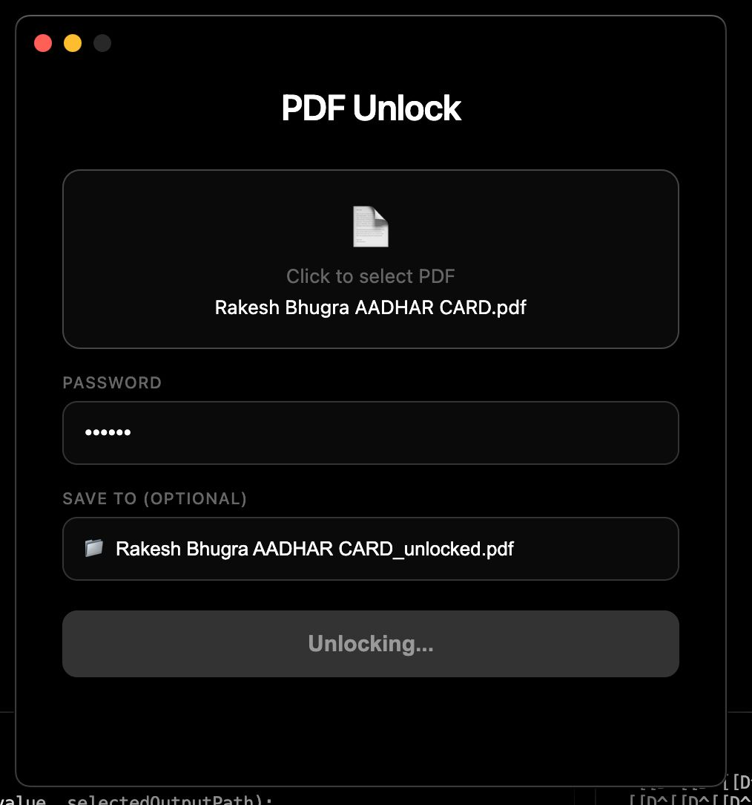

# PDF Unlock

A simple macOS app to remove password protection from PDFs.



## Download

Download the latest `.dmg` from the [Releases](https://github.com/rakeshbhugra/pdf-unlock/releases) page.

## Usage

1. Select PDF - Click the file zone to choose a password-protected PDF
2. Enter Password - Type the PDF's password
3. Choose Output (optional) - Pick where to save the unlocked file, or it saves next to the original as `filename_unlocked.pdf`
4. Unlock - Click the button and wait for confirmation

## Project Structure

```
pdf-unlock/
├── main.py                     # Python CLI for PDF unlocking
├── pyproject.toml              # Python dependencies
├── electron-app/
│   ├── package.json            # Electron config and build settings
│   ├── main.js                 # Electron main process
│   ├── preload.js              # IPC bridge (secure context)
│   ├── renderer/
│   │   ├── index.html          # UI markup and styles
│   │   └── renderer.js         # UI logic
│   └── resources/
│       └── pdf-unlock          # Bundled Python binary
└── screenshot.png
```

## Building from Source

### Prerequisites

- Node.js 18+
- Python 3.10+
- uv (Python package manager) - https://github.com/astral-sh/uv

### Steps

```bash
# Clone the repo
git clone https://github.com/rakeshbhugra/pdf-unlock.git
cd pdf-unlock

# Install Python dependencies and build binary
uv sync
uv run pyinstaller --onefile --name pdf-unlock main.py
cp dist/pdf-unlock electron-app/resources/

# Build Electron app
cd electron-app
npm install
npm run build
```

The built `.dmg` will be in `electron-app/dist/`.

## Development

```bash
cd electron-app
npm start
```

## License

MIT
